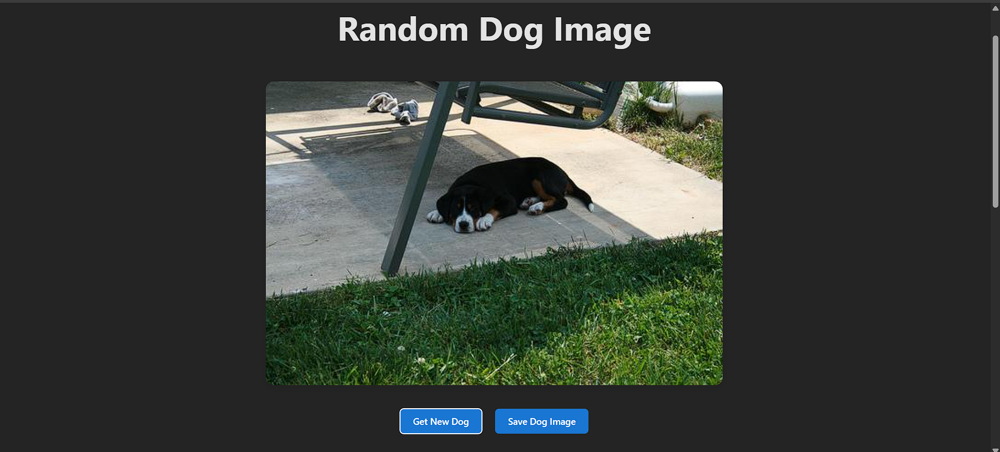
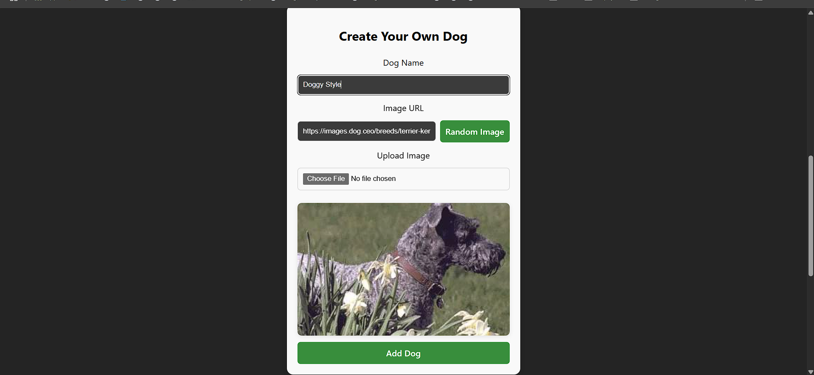
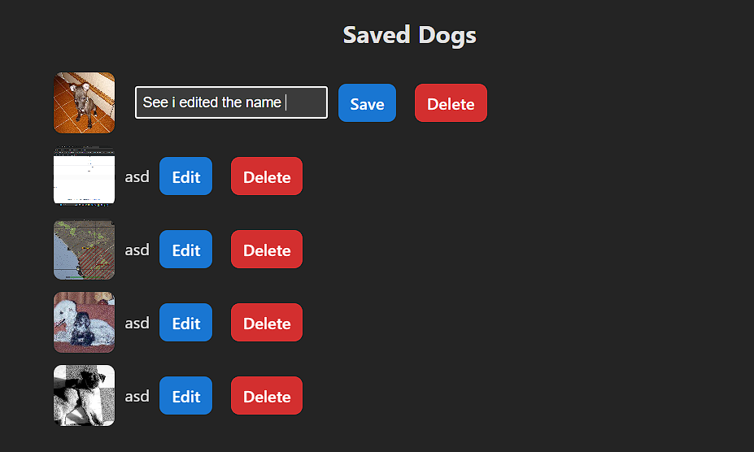
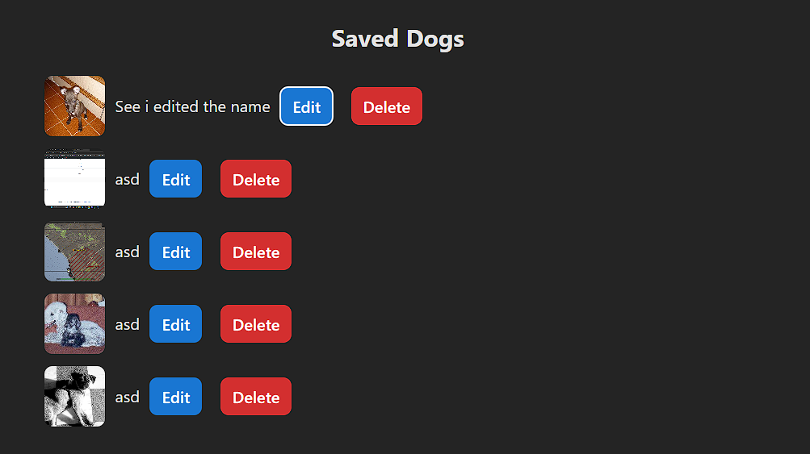

# Olympus Entertainment Web Development Task - Vue 3 CRUD App
Full client side CRUD web app built with vue 3. The app allows users to fetch, save, edit, delete and create using either their own images or dog api's images

## Features

**Create**
- Save random dogs from the Dog API 
- Manually add a new dog using the form provided
- Upload custom dog images
    - Restricted file types to common image types: jpg, jpeg, png, webp
    - Javascript validation added as well to ensure this

**Read**
- View any saved dogs with the image + name

**Update** 
- Edit any saved dogs within the array (only names)

**Delete**
- Remove a dog from the saved list with confirmation

---
## Demo Images

**Basic fetch and Save**


**Manual Dog Creation with Previewer**


**Dog Array Displayed with edit/delete Functionality**


**Edit Functionality in Play (Edit Start)**


**Edit Complete (Edit End)**


---

## Tech Stack
- [Vue 3](https://vuejs.org/) with Composition API and SFCs
- [Vite](https://vitejs.dev/) for fast bundling
- CSS, Vue, HTML, JavaScript
- GitHub Desktop for branches, commits etc.

## How to Use the app

### Option 1: Git Clone
```
git clone https://github.com/MartynOrchard1/oly-web-dev-task.git
cd oly
npm install
npm run dev
```

### Option 2: Download Zip
- Download zip from [github](https://github.com/MartynOrchard1/oly-web-dev-task)
- Open in Visual Studio Code
- In Terminal: 
    - `cd oly`
    - `npm install`
    - `npm run dev`

## API Reference
- API Link for random dogs:
    - `https://dog.ceo/api/breeds/image/random`
- Website/docs:
    - [Link To Dog API](https://dog.ceo/dog-api/)

## Form + Uploading Rules
- You can manually create a dog entry by:
    - Typing a custom name
    - Providing a direct image URL or
    - Uploading a valid image file from your computer
- Accepted File Types: `.png, .jpg, .jpeg, .webp`
- Invalid file types are blocked with alerts + file reset

## Author 
Created by Martyn James Orchard
3rd Year Student in BICT At UCOL Double Majoring in Software Engineering & Web Development